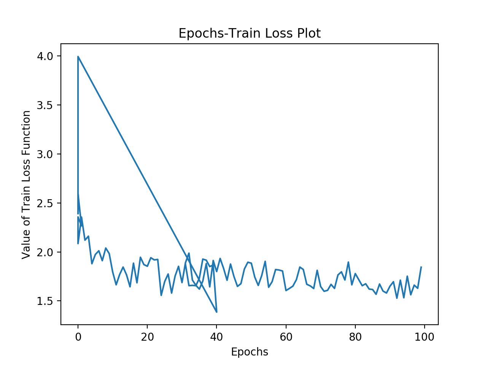
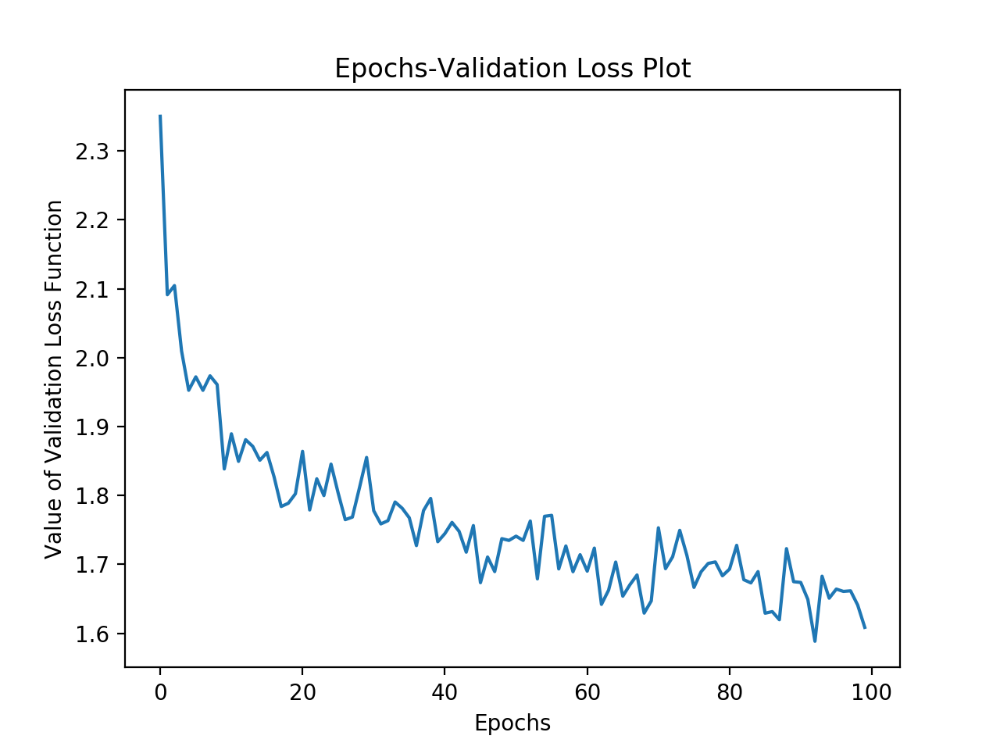
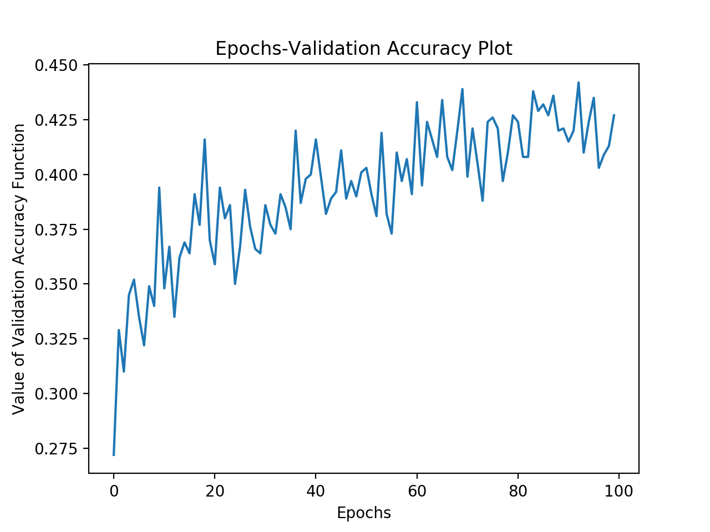

> エポック数とイテレーションに応じた損失関数値比較実験覚書

>## 標準状態
`EPOCHS` = 100<br/>
`ITERATION_NUM` = 100
<br/><br/>
[結果]<br/>
<!-- <br/> -->
<br/>
<br/>
- エポック数が増えるごとにパフォーマンスがよくなる傾向だが早くも成長鈍化の兆し
 - 損失関数にcross entropy用いたから対数関数的挙動は必然？

>## EPOCHSを増やして, ITERATION_NUMを普遍のまま実験 -- under conducting
`EPOCHS` = 1000<br/>
`ITERATION_NUM` = 100<br/>
[結果]<br/>
<br/>


[注意]<br/>
`train_loss.csv`を`tr_loss_E.csv`に改名しておくこと<br/>
`validation_loss.csv`を`val_loss_E.csv`に改名しておくこと
<br/><br/>
- 正答率50%は確実に行きそう

>## EPOCHS不変, ITERATION_NUMを増やす実験
`EPOCHS` = 100<br/>
`ITERATION_NUM` = 1000<br/>
[結果]<br/>
<br/>
<br/>
<br/>

- ITERATION_NUMを増やすのは(やはり)正答率向上に直結する印象
[注意]<br/>
`train_loss.csv`を`tr_loss_I.csv`に改名しておくこと<br/>
`validation_loss.csv`を`val_loss_I.csv`に改名しておくこと
<br/><br/>

>## EPOCHSもITERATION_NUMも増やす実験
`EPOCHS` = 1000<br/>
`ITERATION_NUM` = 1000<br/>
[結果]<br/>
<br/>
<br/>
<br/>

[注意]<br/>
`train_loss.csv`を`tr_loss_EI.csv`に改名しておくこと<br/>
`validation_loss.csv`を`val_loss_EI.csv`に改名しておくこと
<br/><br/>

>## グラフ画像命名規則
`val_loss_E.png`, `tr_loss_EI.png`みたいな

>## 他
1. BatchNormのaffine=True: だめ
2. 中間層をコピで増やした
- 早くも過学習の兆候
3. `OUTPUT_CHANNELS = 64`(初期50)
- val_acc上がってる, いい感じ？ -> 100にしたら更にいい感じ
- 一方128にしたらひどくなった(0wpoch目5%!!)。う〜ん
- 大きな値にするにつれ0epoch目は酷くなるが上り調子がすごくなる気がする(最初が酷い分当たり前にも思えるが)
- 初期epoch時での評価はよくない。いわば過渡特性で論じてるようなもの
[OUTPUT_CHANNELS = 100]
```
epoch:  0 val loss:  2.209050178527832 val acc:  0.276
epoch:  1 val loss:  1.998693823814392 val acc:  0.352
epoch:  2 val loss:  1.9457672834396362 val acc:  0.34
epoch:  3 val loss:  1.9221258163452148 val acc:  0.348
```

[OUTPUT_CHANNELS = 128]
```
epoch:  0 val loss:  3.518066883087158 val acc:  0.054
epoch:  1 val loss:  2.643855333328247 val acc:  0.217
epoch:  2 val loss:  2.179863214492798 val acc:  0.282
epoch:  3 val loss:  2.06441330909729 val acc:  0.3
```

4. ADAMの学習率変えてみる
[lr=0.1]
```
epoch:  0 val loss:  2.608400821685791 val acc:  0.169
epoch:  1 val loss:  2.172215461730957 val acc:  0.275
epoch:  2 val loss:  2.1225783824920654 val acc:  0.299
```
[lr=0.01]
```
epoch:  0 val loss:  2.1932995319366455 val acc:  0.277
epoch:  1 val loss:  2.178264617919922 val acc:  0.263
epoch:  2 val loss:  2.0464468002319336 val acc:  0.31
```
短期的な検証だと学習率変更による正答率も検証できないのでやめました。
ADAM自体はパラメタ更新則におけるデファクトスタンダードのようなので引き続き使用予定


